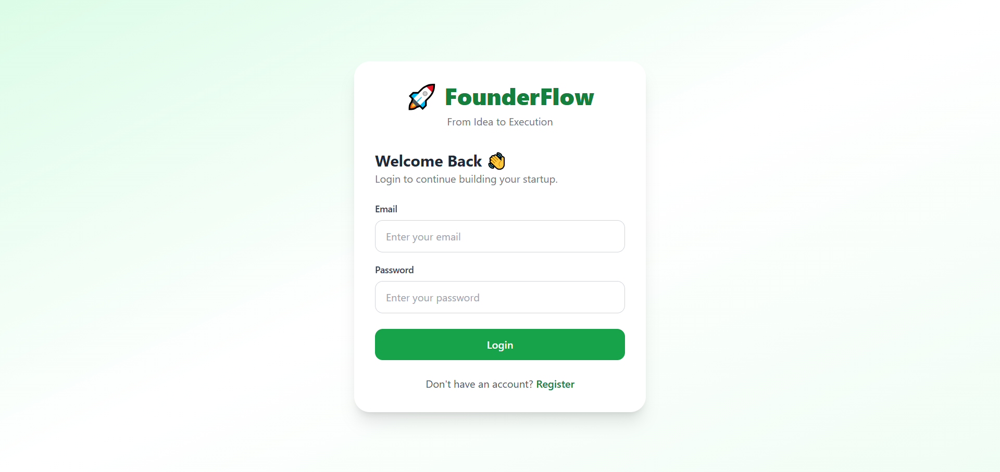
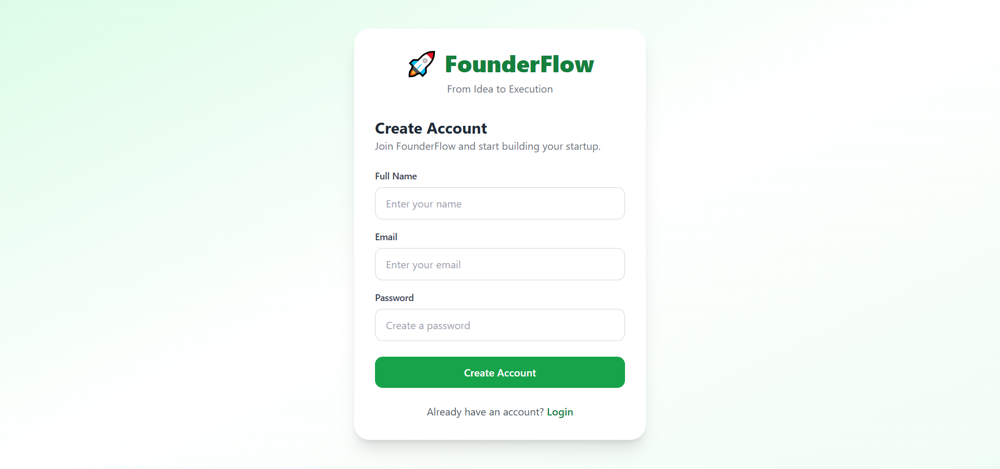
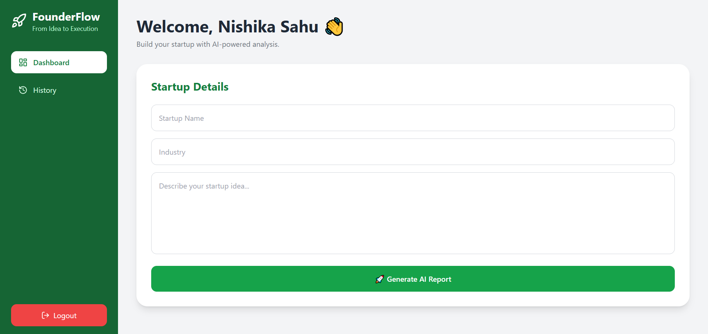
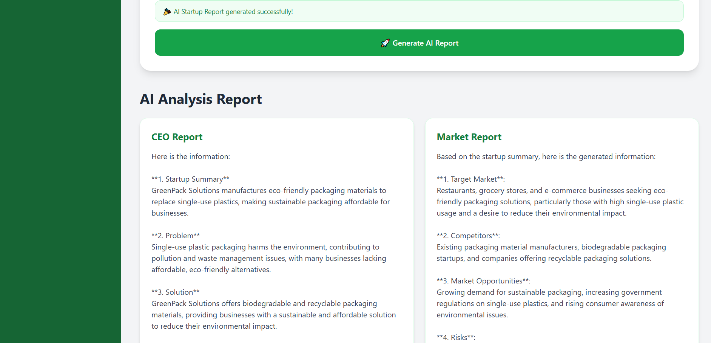
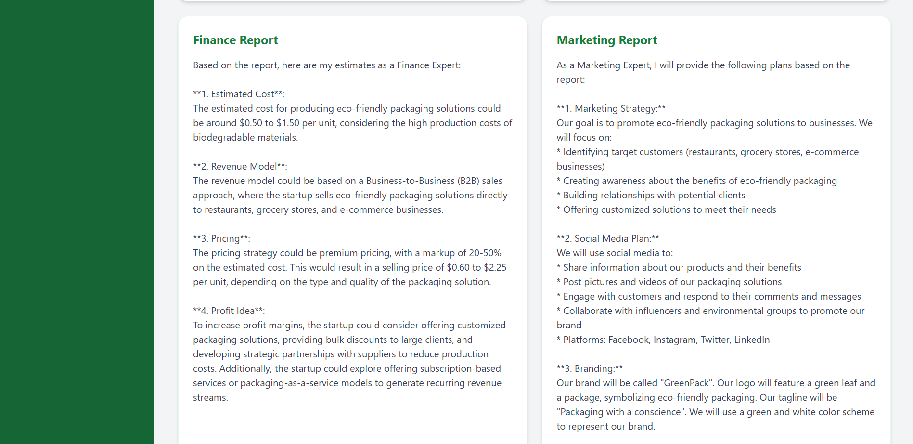
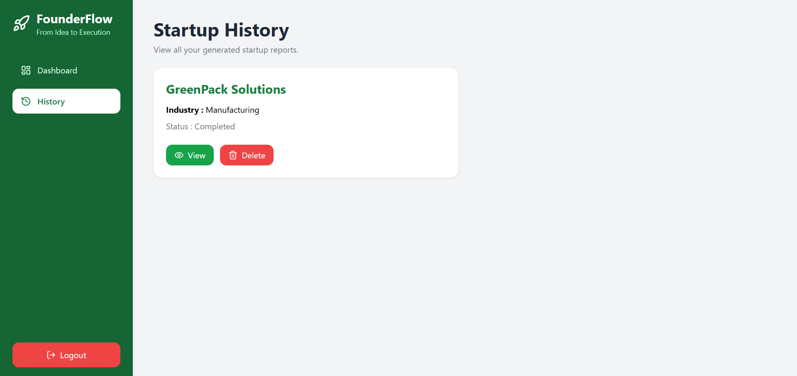
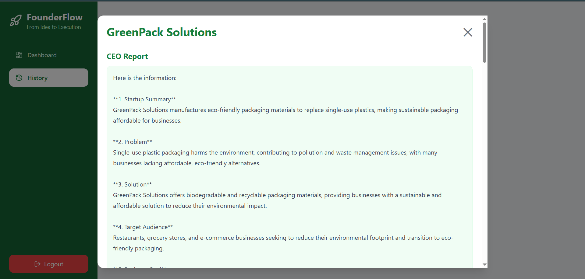
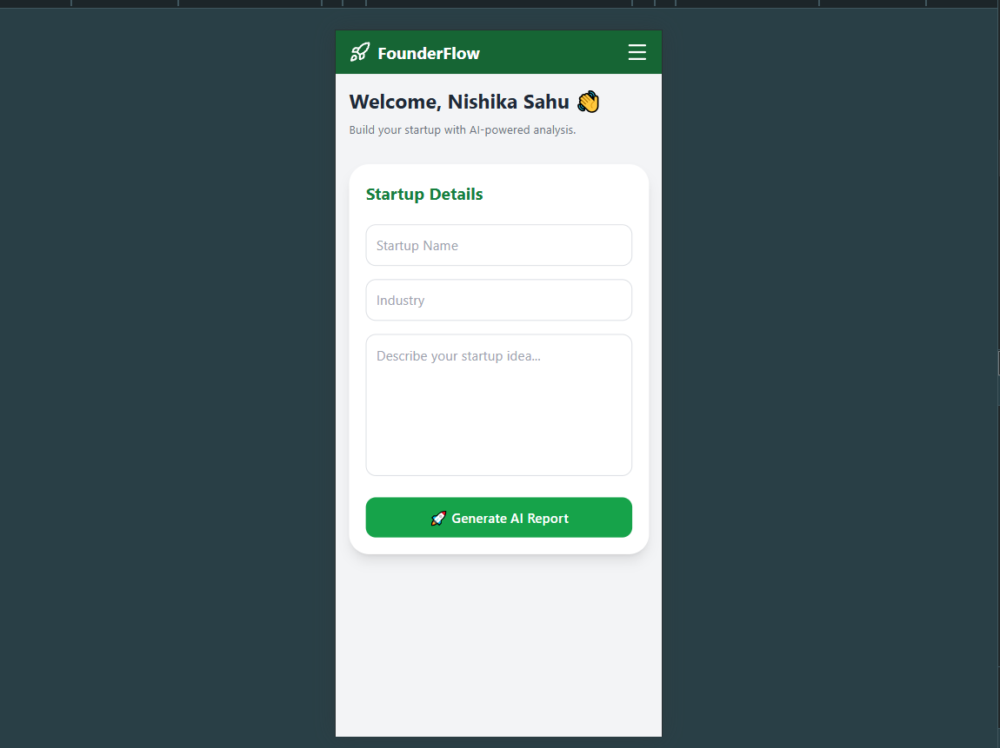
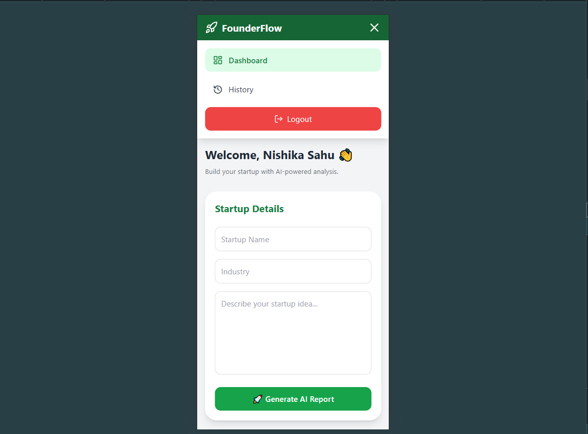
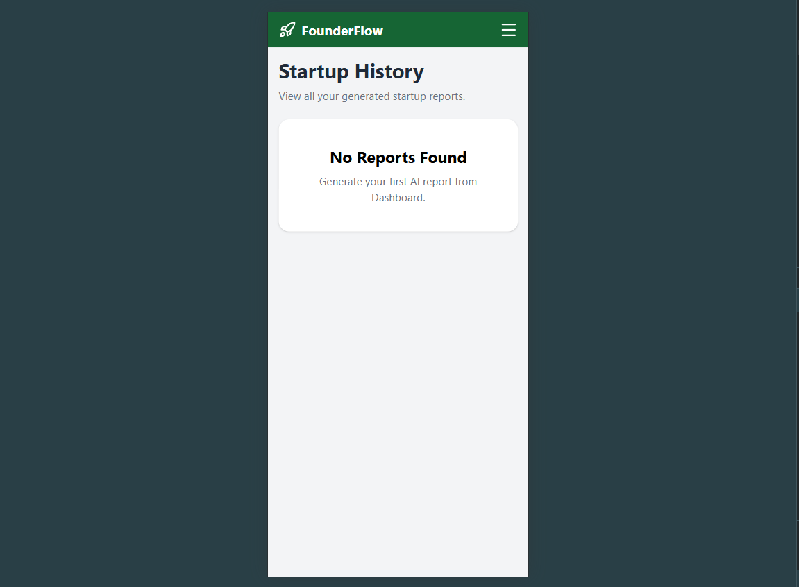

# 🚀 FounderFlow

FounderFlow is an AI-powered **Multi-Agent Startup Analysis Platform** that helps entrepreneurs transform startup ideas into detailed business reports. Instead of relying on a single AI response, the platform uses multiple specialized AI agents that work together to analyze different aspects of a startup.

Each agent has its own responsibility, allowing users to receive comprehensive insights from different business perspectives.

---

# ✨ Features

- 👤 User Registration & Login
- 🤖 Multi-Agent AI Workflow
- 📝 Startup Idea Submission
- 📊 CEO Strategy Report
- 📈 Market Analysis Report
- 💰 Financial Planning Report
- 📢 Marketing Strategy Report
- 💻 Technology Recommendation Report
- 📜 Startup History
- 🗑️ Delete Saved Reports
- 📱 Responsive Design
- 🔒 Protected Routes

---

# 🤖 Multi-Agent Architecture

FounderFlow uses **LangGraph** to coordinate multiple AI agents.

### Workflow

```
User
   │
   ▼
Enter Startup Details
   │
   ▼
LangGraph Workflow
   │
   ├──────────────► CEO Agent
   │
   ├──────────────► Market Research Agent
   │
   ├──────────────► Finance Agent
   │
   ├──────────────► Marketing Agent
   │
   └──────────────► Technology Agent
                     │
                     ▼
          Combined Startup Report
                     │
                     ▼
         Save Report in SQLite Database
                     │
                     ▼
              Display to User
```

Each AI agent focuses on a specific business domain:

### 👨‍💼 CEO Agent
- Business strategy
- Vision
- Growth opportunities
- Business model suggestions

### 📈 Market Research Agent
- Target audience
- Competitor analysis
- Market trends
- Industry insights

### 💰 Finance Agent
- Revenue model
- Estimated costs
- Profitability
- Financial planning

### 📢 Marketing Agent
- Branding ideas
- Customer acquisition
- Marketing channels
- Promotion strategy

### 💻 Technology Agent
- Technology stack
- Development roadmap
- Scalability suggestions
- Technical recommendations

The outputs from all agents are combined into one comprehensive startup report and stored in the database for future reference.

---

# 🛠 Tech Stack

## Frontend
- React.js
- Tailwind CSS
- React Router
- Axios
- Lucide React

## Backend
- FastAPI
- SQLAlchemy
- SQLite
- LangChain
- LangGraph
- Groq LLM

---

# 📂 Project Structure

```
FounderFlow
│
├── frontend
│   ├── components
│   ├── pages
│   ├── services
│   └── App.jsx
│
├── backend
│   ├── config
│   ├── graph
│   ├── models
│   ├── routes
│   ├── schema
│   ├── services
│   ├── main.py
│   └── requirements.txt
│
└── README.md
```

---

# ⚙️ Installation

## Clone Repository

```bash
git clone <repository-url>
```

---

## Backend Setup

```bash
cd backend

python -m venv venv

venv\Scripts\activate

pip install -r requirements.txt
```

Create a `.env` file:

```env
GROQ_API_KEY=your_api_key
```

Run the backend:

```bash
uvicorn main:app --reload
```

---

## Frontend Setup

```bash
cd frontend

npm install

npm run dev
```

---

# 🗄 Database

FounderFlow uses **SQLite** to store:

- User information
- Startup ideas
- AI-generated reports
- Startup history

Generated reports are permanently stored and can be viewed or deleted later from the History page.

---

# 🔄 Application Flow

```
User Login/Register
        │
        ▼
Dashboard
        │
        ▼
Enter Startup Details
        │
        ▼
Generate AI Report
        │
        ▼
LangGraph Multi-Agent Workflow
        │
        ▼
CEO + Market + Finance + Marketing + Technology Agents
        │
        ▼
Merge Reports
        │
        ▼
Save to SQLite Database
        │
        ▼
Display Report
        │
        ▼
History Page
        │
        ├── View Reports
        └── Delete Reports
```

---

# 📸 Screenshots


- Login Page

- Register Page

- Dashboard

- AI Report
 

- History Page
 

- Mobile View




---

🌐 Live Demo: https://founder-ai-mu.vercel.app/

# 👩‍💻 Author

**Nishika Sahu**

---

# 📄 License

This project was developed for educational purposes.
